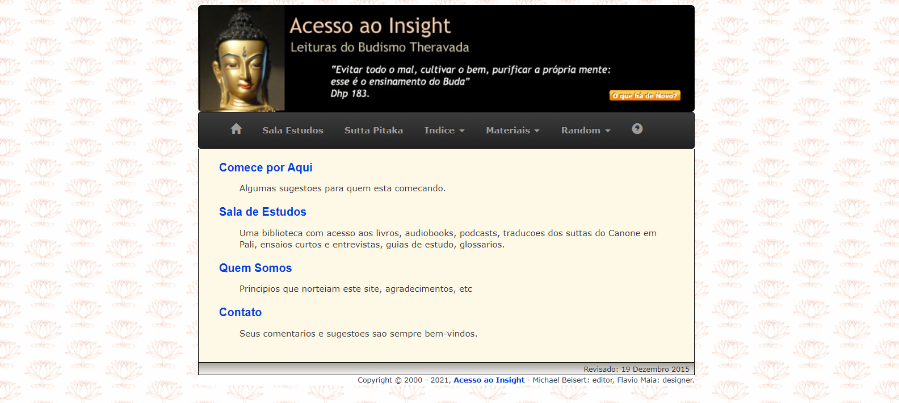
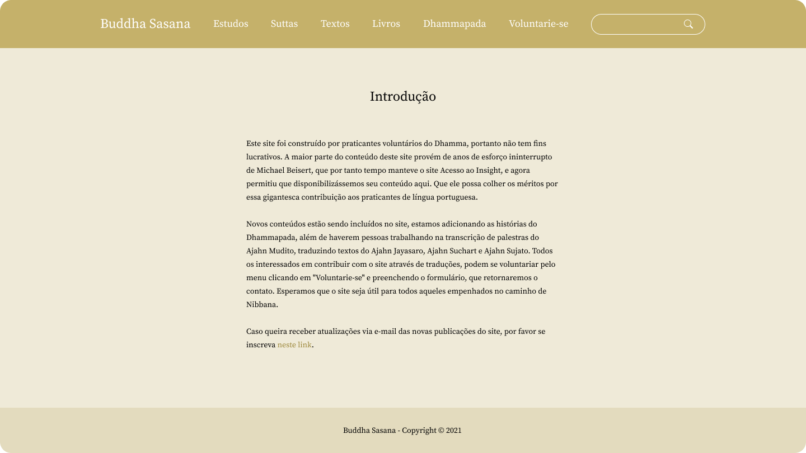
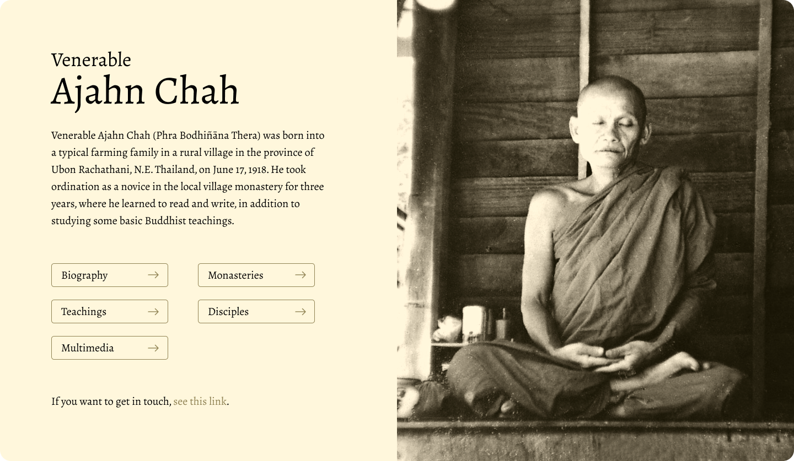

<h1>www.buddhasasana.com.br</h1>

One of the biggest buddhism websites.

### Introduction

Access to Insight, a website well known among buddhist practitioners of the Theravada tradition, and accepted by all other buddhist traditions, communicated its shutdown in late 2021.

As we were practitioners and knew the maintainers, we were able to obtain the original site and restructure it in a cleaner and more modern way.

This work involved many volunteers, and fortunately with our work, the website is once again accessible to the entire Buddhist community, something very valuable as it contains thousands of sacred texts.

### Importance

This website holds thousands of sacred Buddhist texts, focusing on the Sutta Pitaka, which are the most sought after by laypeople and practitioners.

The Sutta Pitaka, the second division of the Tipitaka, comprises the suttas, or discourses, delivered by the Buddha and his closest disciples during the forty-five years of his teaching career.

There are about 11,500 speeches in the Sutta Pitaka, and Access to Insight provides a considerable number with almost 8,000 suttas translated into Portuguese.

### Old version

### New version

### Monks pages

